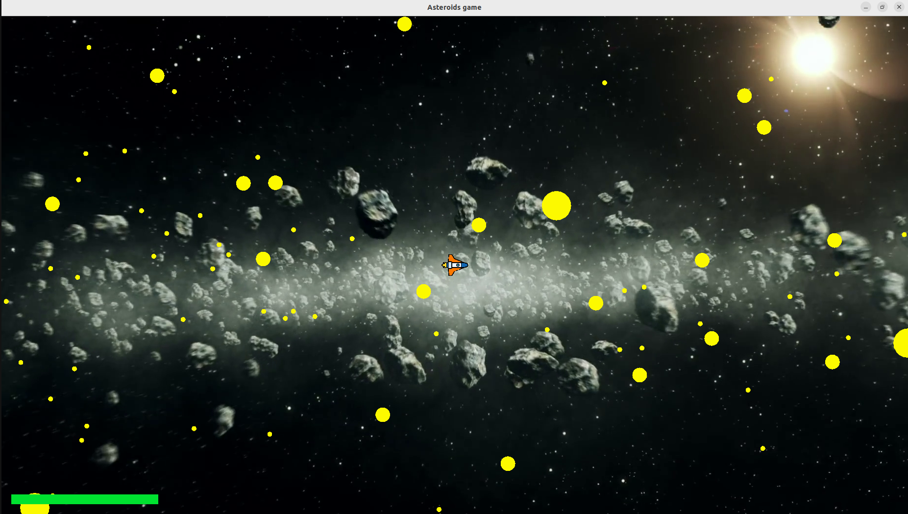

# Asteroids Game (with Macroquad and Gamepad Support)

This is an implementation of the classic "Asteroids" game using the Macroquad game engine. The player controls a spaceship to avoid and destroy asteroids using missiles. The game offers multiple difficulty levels.

<p align="center">
  
</p>

## How to Play

### Keyboard Controls:
- **Left Arrow**: Rotate left
- **Right Arrow**: Rotate right
- **Up Arrow**: Accelerate
- **Space**: Fire a missile
- **Escape**: Quit the game

### Gamepad Controls:
- **Left Stick Left**: Rotate left
- **Left Stick Right**: Rotate right
- **Left Stick Up**: Accelerate
- **R1 (Right Shoulder Button)**: Fire a missile
- **B Button**: Quit the game

## Game Objective
- Destroy all asteroids while avoiding collisions.
- The game ends if the spaceship is destroyed.
- If all asteroids are eliminated, the player wins.

## Installation and Running the Game

### Prerequisites:
- Rust installed on your system
- `cargo` package manager
- Linux users may need to install additional dependencies to play with a gamepad: `sudo apt-get install libudev-dev`

### Steps to Run:
```sh
cd src
cargo run 
```

## Features
- **Realistic Physics**: Objects move and collide dynamically.
- **Multiple Difficulty Levels**: Easy, Medium, and Hard.
- **Gamepad Support**: Play with a controller.
- **Dynamic Window Resizing**: Adjusts to different screen sizes.
- **Health System**: The spaceship has a shield represented by a health bar.


